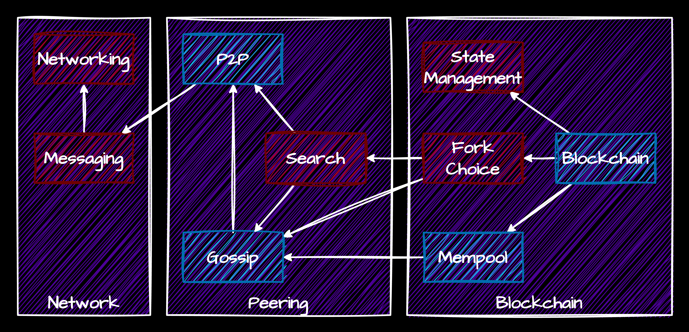

# Let's make some money - Blockchain workshop

## Introduction

This workshop is designed to give you a deeper understanding how decentralized systems work and how to build your own blockchain. We will start with simple networking primitives, build some decentralized communication primitives on top of those, and finally build a simple blockchain.

## Prerequisites

- Basic understanding of Python
- Basic understanding of networking
- Basic understanding of cryptography

## System overview



The system consists of multiple components, which use the abstractions provided by the underlying system, and build more complex systems on top of them.

### The network layer

For the network layer, you are provided with a simple TCP-based networking layer, which allows you to send and receive messages between nodes. The system is based on a simple event-driven architecture, where you can register event handlers for different events.

The system allows subscription to following events:

- `on_connect(conn, incoming)` - called when a new connection is established. `conn` is the connection object, and `incoming` is a boolean indicating if the connection was initiated by us (`False`) or by the peer (`True`).
- `on_disconnect(conn, incoming)` - called when a connection is closed. `conn` is the connection object, and `incoming` is a boolean indicating if the disconnect was initiated by us (`False`) or by the peer (`True`).
- `on_message(conn, message)` - called when a new message is received. `conn` is the connection object, and `message` is the received message.

Very rarely to you need to use the raw network layer directly, as most of the time you will be using the higher-level abstractions built on top of it.

On top of the network layer, you are provided with a simple messaging layer, which allows you to send and receive messages between nodes. The messaging layer is based on a simple message format, where each message has a **kind** and a **payload**. Furthermore, messages can be responded to, allowing for request-response style communication.

To use the messaging layer, you first need to register a message handler using `register_handler` for a specific message kind. The handler will be called whenever a message of that kind is received. If the message is a request, the handler should return the response payload (or `None` to indicate no response). If the message is not a request, the handler should return `None`.

To send a message, you can use the `send_message` method. If the message is a request, you should specify the `response_handler` parameter, which is a function that will be called when the response is received. If the response does not arrive within a time limit, the `response_handler` will be called with `None`.

### The peering layer

For the peering layer, your task will be to build a simple P2P node, that will allow nodes to connect to each other, and maintain a list of peers. The number of peers per node is limited, to prevent any single node from being overwhelmed. The P2P protocol is very simple:

* When a node connects to another node, it sends a `p2p:hello` message, containing its address. The receiver should either:
  * resont with `\x01` + its list of peers, if it accepts the connection, or
  * respond with `\x00` + its list of peers, if it rejects the connection

  If the connection is accepted, both nodes should add each other to their peer list. Otherwise, the connection should be closed, and the node should try to connect to one of the peers provided in the response.

  The list of peers is a comma-separated list of `host:port` strings.

* Nodes can send `p2p:get_peers` messages to ask for the list of peers of the other node. The receiver should respond with a list of its peers.

On top of that, you will build a simple gossip layer, that will allow nodes to broadcast messages to each other, even if they are not directly connected, by passing the messages through the network. The gossip protocol is very simple:

* A gossip message contains a random 16-byte identifier created at the sender side.
* When a node wants to send a gossip message, it sends a `gossip:<kind>` message to all of its peers, containing the message identifier and the message payload.
* When a node receives a `gossip:<kind>` message:
  * It checks if it has already seen the message identifier. If it has, it ignores the message.
  * If it hasn't seen the message identifier, it processes the message (by calling the registered handler) which should return `True` if the message was processed successfully, or `False` if it invalid.
  * If the message was processed successfully, it broadcasts the message to all of its peers (except the one it received the message from).

On top of that, you are provided with a simple search implementation, which uses the gossip layer to search for messages in the network, and uses the return-path to send the response back to the requester.


### The blockchain layer

For the blockchain layer, you will be provided with the most of the "dirty" stuff: 
* the state management component, which hangles persistence of the blockchain,
* the fork choice component, which handles the selection of the correct chain in case of a fork
* the chain canonicalization component, which handles applying the blocks to the state, fetching missing blocks from the network, and rewinding in case of reorgs

Your task will be to implement the core of the blockchain: 
* the state transition function, which given a block and the current state of the blockchain, will return the new state of the blockchain,
* the block building function, which given the current state of the blockchain and the mempool (list of all transactions), will return a new block that can be added to the blockchain.
* the mempool management, which will handle collecting transactions from the network, and providing them to the block builder.

# The tasks

## Part 1: P2P Node

### Introduction

In this part, you will implement a simple P2P node, that will allow nodes to connect to each other, and maintain a list of peers.

### Your task

In the file [p2p.py](bcws/p2p.py), you will find a skeleton of the `P2PNode` class. Your task is to implement the following methods:

- `__init__`: A constructor that initializes the P2P node with the given parameters. You are given the following:
  -  `TcpServer` - instance to use for connecting to other nodes
  -  `Messaging` - instance to use for sending and receiving messages
  -  `max_peers` - maximum number of peers to maintain (you should always keep at least half of this number, and never exceed double this number).
  -  `bootstrap_nodes` - list of initial nodes to connect to when starting the node
- `start`: Starts any background tasks, and connects to the bootstrap nodes.
- `stop`: Stops all background tasks, and disconnects from all peers.
- `register_handler`: Registers a message handler for a specific p2p message kind. The handler is similar to the messaging layer handlers, but takes a `P2PPeer` instead of a `TcpConnection`.
- `connect_to_peer`: Connects to a new peer at the given address. Should send a `p2p:hello` message, and handle the response accordingly.
- `disconnect_peer`: Disconnects from the given peer, and removes it from the peer list.
- `send_message`: Sends a message to the given peer, by invoking the messaging layer.
- `broadcast_message`: Broadcasts a message to all connected peers.

Keep in mind that the P2P node should maintain the peer list, by connecting to new peers when the number of peers drops below half of the maximum, and disconnecting from peers when the number of peers exceeds the maximum. The peer count can be checked periodically in a background task.

### Messages used

- `p2p:hello`
  - Request: `host:port` string of the sender
  - Resopnse: `(0x00 | 0x01) + peer_list`
    - `0x00` - connection rejected
    - `0x01` - connection accepted
    - `peer_list` - comma-separated list of `host:port` strings
- `p2p:get_peers`
  - Request: empty
  - Response: `peer_list`
    - `peer_list` - comma-separated list of `host:port` strings

## Part 2: Gossip

### Introduction

Gossip is a simple protocol that allows nodes to share information with each other, even if they are not directly connected. In this part we will build a simplified gossip layer that will allow us to share messages between nodes.

Each node maintains a list of messages that it has seen. When a node receives a new message (via a `gossip:<kind>`), it should add it to the list of seen messages, and broadcast it to all of its peers.

Gossip is implemented similarly to messaging, where each message has a kind and a payload, and you register handlers for specific kinds. Note that it still uses the previously implemented messaging layer, wrapping each gossip message in a `gossip:<kind>` message.

Each message contains a unique random identifier. This identifier is used to check if we have already seen the message.

### Your task

In the file [gossip.py](bcws/gossip.py) you will find a skeleton of a `Gossip` class. This class should implement a simple gossip layer that will allow us to share messages between nodes. Your task is to implement this class. The class should have the following methods:

- `__init__`: A constructor that initializes the gossip layer with the given P2P node.
- `start`: Starts any background tasks needed for the gossip layer.
- `stop`: Stops all background tasks.
- `broadcast`: Broadcasts a message to all peers.
- `register_handler`: Registers a message handler for a specific gossip message kind.

Keep in mind that the gossip layer should maintain a list of seen messages, and should not process messages that have already been seen. Also, the list of seen messages should be cleaned up periodically to prevent it from growing indefinitely.

### Messages used

- `gossip:<kind>`
  - Payload: `msg_id + message_payload`
    - `msg_id` - 16-byte random identifier of the message
    - `message_payload` - the actual payload of the message

## Part 3: Mempool

### Introduction

The mempool is a component of the blockchain that is responsible for collecting and managing transactions before they are included in a block. This includes:
* Sending and receiving transactions from the network
* Storing transactions in a local pool
* Providing transactions to the block builder when requested
* Evicting old transactions from the pool (e.g., transactions that have been in the pool for too long, and will likely never be included in a block)

In this part, you will implement a simple mempool that will allow nodes to collect transactions from the network, and provide them to the block builder.

### Your task

In the file [mempool.py](bcws/blockchain.py) you will find a skeleton of a `Mempool` class. This class should implement the following methods:

- `__init__`: A constructor that initializes the mempool with the given parameters. You are given the following:
  - `gossip` - instance of the gossip layer to use for receiving transactions
- `start`: Starts any background tasks needed for the mempool.
- `stop`: Stops all background tasks.
- `announce_transaction`: Announces a new transaction to the network, and adds it to the mempool.
- `get_transactions`: Returns a list of all transactions in the mempool.
- `evict_transaction`: Evicts a transaction from the mempool (either because it was included in a block, or because it is deemed invalid).

Keep in mind that the mempool should maintain a list of transactions, and should evict old transactions periodically to prevent the pool from growing indefinitely.

### Messages used

- Gossip kind: `bc:new_tx`
  - Payload: serialized transaction

## Part 4: Block building and execution

### Introduction

Execution is the core of the blockchain. It is responsible for applying the state transition function, which given a block and the current state of the blockchain, will return the new state of the blockchain.

Block building is a related component, which is responsible for producing a new block, given the state of the blockchain and the mempool (list of all transactions), by selecting valid transactions from the mempool, and creating a new block that can be added to the blockchain.

### Your task

In the file [blockchain.py](bcws/blockchain.py) you will find a skeleton of the `Blockchain` class. This class should implement the following methods:

- `build_block`: Given the current state of the blockchain and the mempool, builds a new block that can be added to the blockchain. Arguments are:
  - `state` - current state of the blockchain, which is discarded after building the block.
  - `coinbase` - address to send the block reward to (will be the miner's address)
  - `mempool` - instance of the mempool to get transactions from
  - returns the new block (even if empty)

- `apply_block`: Given a block and the current state of the blockchain, validates and applies the block to the state. Arguments are:
  - `state` - current state of the blockchain, which *should be modified*.
  - `block` - block to apply
  - returns `True` if the block is valid and was applied successfully, `False` otherwise (if `False`, the state modications are discarded)

Make sure to validate the block before applying it, including:
* checking the block's hash meets the difficulty requirement
* checking the block's parent is the current tip of the chain
* checking all transactions in the block are valid (e.g., no double spends, sufficient balance, etc.)

If a block is invalid, the state can be left in any state, as the caller will discard it.

# Appendix

This section contains additional information that is not directly related to the tasks, but is intended for those who want to dive deeper into the implementation.

## Message formats

### Networking layer

Networking layer is implemented in the `network.py` file, and is based on a simple event-driven architecture. The `TcpServer` class is responsible for managing TCP connections, and allows registering event handlers for different events.

All messages sent via the networking layer are prefixed with a 4-byte length field, indicating the length of the message, followed by the message payload.

### Messaging layer

Messaging layer is implemented in the `messaging.py` file, and is built on top of the networking layer. The `Messaging` class is responsible for sending and receiving messages, and allows registering message handlers for different message kinds.

Messages sent via the messaging layer have the following format:
- 1-byte message type
  - `0x00` - regular message
  - `0x01` - request that expects a response
  - `0x02` - response
- 4-byte message ID
- zero-terminated message kind string
- message payload

### Blockchain types

All blockchain-related types are defined in the `blockchain_types.py` file. They are sent over the network in plain-text (in real systems, you would want to use a more efficient serialization format, such as Protocol Buffers or RLP).

Transactions are represented as comma-separated strings in the following format:

```
sender,recipient,nonce,amount,signature
```

- `sender` - hex-encoded public key of the sender
- `recipient` - hex-encoded public key of the recipient
- `nonce` - integer nonce of the transaction
- `amount` - integer amount to transfer
- `signature_hex` - hex-encoded signature of the transaction (signature is over the string `sender,recipient,nonce,amount`)

Blocks are represented as colon-separated strings in the following format:

```
number:nonce:parent_hash:coinbase:tx1:tx2:...:txN
```

- `number` - integer block number (genesis block is 0)
- `nonce` - integer nonce of the block (used for proof-of-work)
- `parent_hash` - hex-encoded hash of the parent block
- `coinbase` - hex-encoded public key of the miner (receives the block reward)
- `tx1`, `tx2`, ..., `txN` - list of transactions included in the block (serialized as described above)

Block hash is computed as the SHA-256 hash of the block string (as described above).

## Blockchain state transition function

- Block number MUST be parent block number + 1.
- Block parent hash MUST match the hash of the previous block.
- Block hash MUST meet the difficulty requirements, i.e. first `DIFFICULTY` hex digits of the block hash MUST be zero.
- Block must have between 0 and `MAX_TRANSACTIONS_PER_BLOCK` transactions.
- For each transaction in the block:
  - Transaction signature MUST be valid.
  - Sender account MUST have sufficient balance.
  - Transaction nonce MUST match the sender's account nonce.
  - Deduct the amount from the sender's balance, and increment the sender's nonce.
  - If the recipient account does not exist, create it with a balance of 0 and nonce of 0 before adding the amount.
  - Add the amount to the recipient's balance.
- Finally `BLOCK_REWARD` is added to the coinbase account's balance.

### Blockchain parameters
- `BLOCK_REWARD = 10_000` units
- `DIFFICULTY = 7` leading zero hex digits
- `MAX_TRANSACTIONS_PER_BLOCK = 10`